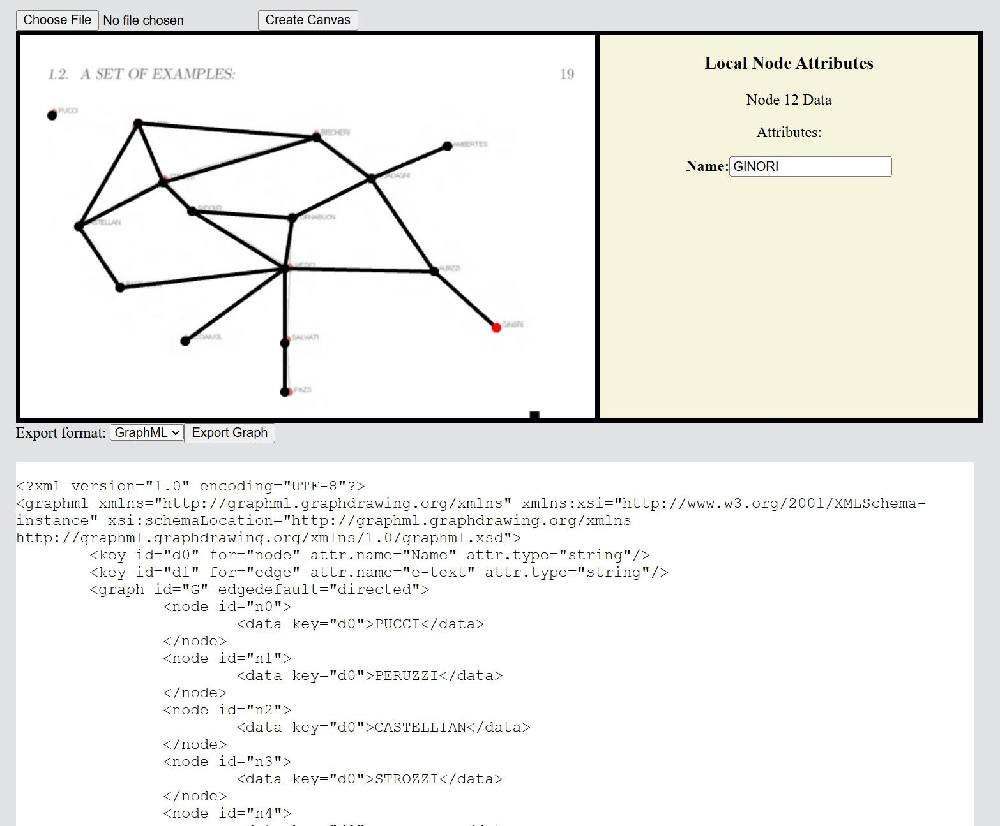

# SILHONET - Graph Builder & Serializer

### About this Project

SilhoNET is a Web-based Graph building tool made for the construction and serialization of combinatorial graphs/networks. It's written in Typescript and built on top of React w/ Vite and WebGL2.

### Running the Project

Still a WIP. Clone the project via `git clone`. Once cloned to your machine, you can run the project by going to the `./frontend` directory of the project and typing `npm run dev`.

### Motivation

While there are many graph building tools online like [Graph Builder](https://csacademy.com/app/graph_editor/) (CS Academy), [Graph Visualizer](https://www.graphvizer.com/) (John & Junhyun), and [GraphVizz](https://www.graphvizz.com/) (PortiESP), they are mostly (1) self-contained, and (2) concerned with teaching standard Graph algorithms (Dijkstra, Kosaraju, BFS, DFS, etc.). To further expand on the "self-contained" point, the extent to which they allow for the "exporting" of created graphs is typically limited to importing & exporting within the app itself, rather than to external applications or code, which results in many of these apps having very specialized export formats for the graphs created.

One motivation of this project was to build a tool for myself that would let me export my graph in various formats easily. As such, this tool currently supports the following graph serialization formats:

- GraphML
- DOT
- EdgeList

The second motivation of this project was found while reading Matthew O. Jackson's text, ["Social and Economic Networks"](https://books.google.com/books/about/Social_and_Economic_Networks.html?id=fEH8EAAAQBAJ). Within the text various example networks are shown and used to explore different metrics over graphs. One of the earliest is the 15th Century Florentine Marriage Network. 

")

While most of the graphs aren't too large or complicated, it would still be pretty annoying writing/typing down text representations of them  all manually. Instead, what I wanted was a way to 'trace' or 'sketch' over the networks in the text and easily serialize them. SilhoNET lets you upload a picture to the canvas and draw a graph over it, making the task of serializing these networks a straightforward ordeal.

Here's the above example network traced and serialized:

### Other Notes

##### October 4th, 2025
- First time *really* using React, so this is all pretty amateur
- Really want to make it look & feel nicer! Think it's very clunky atm